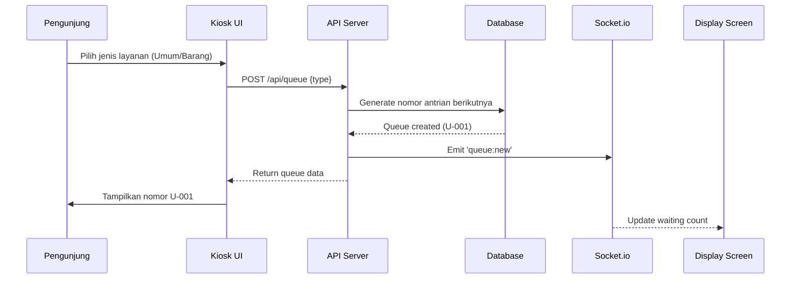
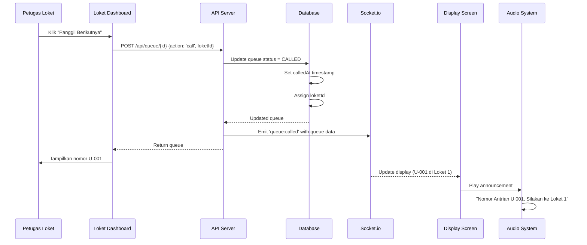
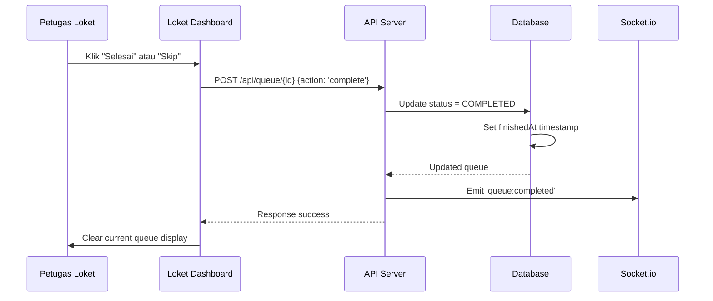
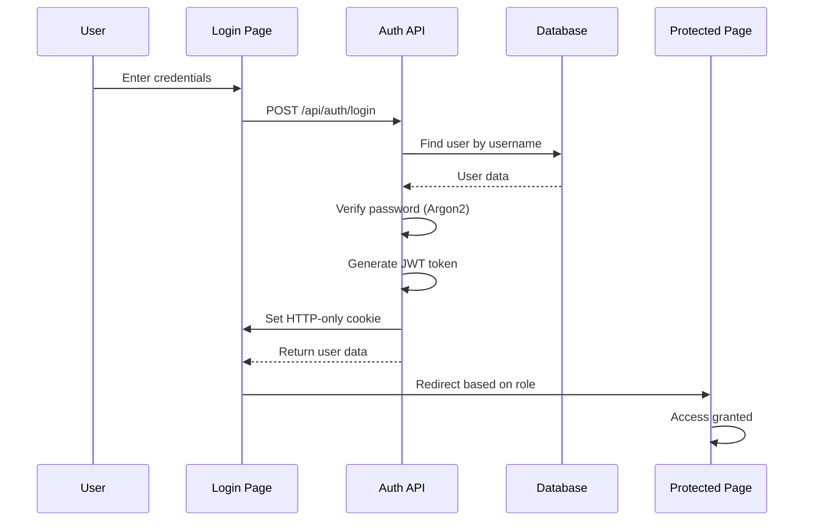

# 📚 Cara Kerja Sistem Antrian

## Daftar Isi

1. [Gambaran Umum](#gambaran-umum)
2. [Arsitektur Sistem](#arsitektur-sistem)
3. [Alur Proses](#alur-proses)
4. [Komponen Utama](#komponen-utama)
5. [Teknologi yang Digunakan](#teknologi-yang-digunakan)
6. [Database Schema](#database-schema)
7. [Real-time Communication](#real-time-communication)
8. [Security & Authentication](#security--authentication)

---

## Gambaran Umum

Sistem Antrian Digital ini adalah aplikasi web full-stack yang dirancang untuk mengelola antrian di Dinas Perhubungan. Sistem ini mendukung:

- **2 Jenis Layanan**: Angkutan Umum dan Angkutan Barang
- **3 Loket Pelayanan**: Loket 1, 2, dan 3 yang dapat beroperasi paralel
- **Real-time Updates**: Semua perubahan antrian langsung tersinkronisasi
- **Multi-Role**: Admin, Petugas, dan Pengunjung

### Fitur Utama

1. **Kiosk** - Pengambilan nomor antrian mandiri
2. **Display** - Layar tampilan publik untuk panggilan antrian
3. **Loket Dashboard** - Interface petugas untuk mengelola antrian
4. **Admin Dashboard** - Laporan dan analitik sistem

---

## Arsitektur Sistem

```
┌─────────────────────────────────────────────────────────────┐
│                     Client Layer                             │
├─────────────┬────────────┬────────────┬─────────────────────┤
│   Kiosk     │  Display   │   Loket    │   Admin Dashboard   │
│  (Public)   │  (Public)  │ (Staff)    │   (Admin Only)      │
└─────────────┴────────────┴────────────┴─────────────────────┘
                           │
                           ▼
┌─────────────────────────────────────────────────────────────┐
│              Next.js Application Server                      │
├─────────────────────────────────────────────────────────────┤
│  • App Router (React Server Components)                     │
│  • API Routes (RESTful Endpoints)                           │
│  • Custom Server (Node.js + Socket.io)                      │
└─────────────────────────────────────────────────────────────┘
                           │
                ┌──────────┴──────────┐
                ▼                     ▼
┌──────────────────────┐   ┌──────────────────────┐
│   PostgreSQL DB      │   │   Socket.io Server   │
│  (Prisma ORM)        │   │  (WebSocket)         │
└──────────────────────┘   └──────────────────────┘
```

### Layer Breakdown

#### 1. **Client Layer**
   - **Kiosk**: Interface touchscreen untuk pengunjung mengambil nomor antrian
   - **Display**: TV Display yang menampilkan nomor yang sedang dipanggil
   - **Loket**: Dashboard petugas untuk memanggil dan melayani antrian
   - **Admin**: Dashboard untuk melihat laporan dan mengelola sistem

#### 2. **Application Server**
   - **Next.js 16**: Framework React dengan App Router untuk SSR dan routing
   - **API Routes**: Endpoint RESTful untuk CRUD operations
   - **Custom Server**: Server Node.js yang mengintegrasikan Socket.io

#### 3. **Data Layer**
   - **PostgreSQL**: Database relasional untuk menyimpan data persistent
   - **Prisma ORM**: Object-Relational Mapping untuk type-safe database access

#### 4. **Real-time Layer**
   - **Socket.io**: WebSocket server untuk komunikasi real-time
   - **Rooms**: Pemisahan channel untuk Display dan Loket

---

## Alur Proses

### 1. Proses Pengambilan Nomor Antrian



**Detail Langkah:**

1. **User Interaction**
   - Pengunjung menyentuh tombol "Angkutan Umum" atau "Angkutan Barang"
   
2. **Queue Generation**
   - System generates nomor urut berdasarkan tanggal hari ini
   - Prefix ditambahkan: `U` untuk Umum, `B` untuk Barang
   - Format: `U-001`, `U-002`, ..., `B-001`, `B-002`
   
3. **Database Record**
   ```typescript
   {
     number: 1,
     code: "U-001",
     type: "UMUM",
     status: "WAITING",
     createdAt: "2025-11-26T00:00:00Z"
   }
   ```
   
4. **Real-time Broadcast**
   - Socket.io emit event `queue:new` ke semua client yang terhubung
   - Display screen update counter antrian menunggu

5. **User Feedback**
   - Kiosk menampilkan nomor antrian selama 5 detik
   - Auto-reset ke halaman awal

---

### 2. Proses Pemanggilan Antrian



**Detail Langkah:**

1. **Fetch Next Queue**
   - System query database untuk antrian tertua dengan status `WAITING`
   - Sort berdasarkan `createdAt ASC`
   
2. **Update Database**
   ```typescript
   {
     status: "CALLED",
     calledAt: new Date(),
     loketId: 1
   }
   ```

3. **Real-time Broadcast**
   - Socket.io emit `queue:called` ke room `display` dan `loket`
   - Payload berisi queue code, loket info

4. **Display Update**
   - Display screen update grid untuk Loket 1
   - Tampilkan nomor antrian yang dipanggil

5. **Audio Announcement**
   - Browser TTS (Text-to-Speech) membaca nomor
   - Format: "Nomor Antrian [U] [Kosong] [Kosong] [Satu], Silakan ke Loket [Satu]"

---

### 3. Proses Penyelesaian Antrian



**Detail Langkah:**

1. **Complete Action**
   - Jika layanan selesai: status = `COMPLETED`
   - Jika customer tidak hadir: status = `SKIPPED`

2. **Timestamp Recording**
   ```typescript
   {
     status: "COMPLETED",
     finishedAt: new Date()
   }
   ```

3. **Analytics Calculation**
   - Wait time = `calledAt - createdAt`
   - Service time = `finishedAt - calledAt`

4. **Reset Loket**
   - Clear current queue di loket dashboard
   - Siap untuk panggil antrian berikutnya

---

## Komponen Utama

### 1. Kiosk Component (`/kiosk/page.tsx`)

**Fungsi:**
- Interface pengambilan nomor antrian
- Touch-friendly untuk layar sentuh

**Key Features:**
- 2 tombol besar untuk pilihan layanan
- Auto-reset setelah 5 detik
- Loading state saat generate queue

**Code Flow:**
```typescript
generateQueue(type) 
  → POST /api/queue 
  → Display queue number 
  → setTimeout(5000) 
  → Reset to home
```

---

### 2. Display Component (`/display/page.tsx`)

**Fungsi:**
- Menampilkan nomor antrian yang sedang dipanggil
- TV display untuk area tunggu

**Key Features:**
- 3-column grid untuk 3 loket
- Real-time Socket.io connection
- Audio announcement
- Running text marquee

**Socket Events:**
```typescript
socket.on('queue:called', (queue) => {
  // Update display grid
  setCurrentCalls(prev => ({
    ...prev,
    [queue.loketId]: queue
  }));
  
  // Play audio
  playAnnouncement(queue.code, queue.loket.name);
});
```

---

### 3. Loket Dashboard Component (`/loket/page.tsx`)

**Fungsi:**
- Dashboard petugas untuk mengelola antrian
- Interface untuk memanggil, recall, complete, skip

**Key Features:**
- Big "Call Next" button
- Current queue display
- Waiting queue preview (10 teratas)
- Recall functionality

**State Management:**
```typescript
const [currentQueue, setCurrentQueue] = useState<Queue | null>(null);
const [waitingQueues, setWaitingQueues] = useState<Queue[]>([]);
```

---

### 4. Admin Dashboard Component (`/admin/page.tsx`)

**Fungsi:**
- Laporan dan statistik antrian
- Filter berdasarkan tanggal

**Key Metrics:**
- Total antrian
- Breakdown by type (Umum/Barang)
- Breakdown by status (Completed/Skipped/Waiting/Called)
- Performance per loket
- Average wait time

**Data Fetching:**
```typescript
GET /api/stats?startDate=2025-11-26&endDate=2025-11-26
```

---

## Teknologi yang Digunakan

### Frontend
- **Next.js 16**: React framework dengan App Router
- **TypeScript**: Type safety
- **Tailwind CSS**: Utility-first CSS framework
- **Shadcn UI**: Pre-built accessible components

### Backend
- **Node.js**: JavaScript runtime
- **Next.js API Routes**: RESTful endpoints
- **Socket.io**: WebSocket untuk real-time
- **Prisma**: ORM untuk database access

### Database
- **PostgreSQL**: Relational database
- **Prisma Schema**: Type-safe schema definition

### Security
- **JWT (jose)**: Token-based authentication
- **Argon2**: Password hashing algorithm
- **HTTP-only Cookies**: Secure token storage

---

## Database Schema

### Entity Relationship Diagram

```
┌──────────────┐         ┌──────────────┐         ┌──────────────┐
│     User     │         │    Loket     │         │    Queue     │
├──────────────┤         ├──────────────┤         ├──────────────┤
│ id (PK)      │────1:1──│ userId (FK)  │────1:N──│ loketId (FK) │
│ username     │         │ id (PK)      │         │ id (PK)      │
│ password     │         │ name         │         │ number       │
│ role         │         │ status       │         │ code         │
│ name         │         │              │         │ type         │
└──────────────┘         └──────────────┘         │ status       │
                                                   │ createdAt    │
                                                   │ calledAt     │
                                                   │ finishedAt   │
                                                   └──────────────┘
```

### Table: `User`

| Field    | Type   | Description              |
|----------|--------|--------------------------|
| id       | UUID   | Primary key              |
| username | String | Unique username          |
| password | String | Argon2 hashed password   |
| role     | Enum   | ADMIN / PETUGAS          |
| name     | String | Full name                |

### Table: `Loket`

| Field    | Type    | Description                  |
|----------|---------|------------------------------|
| id       | Integer | Primary key (1, 2, 3)        |
| name     | String  | "Loket 1", "Loket 2", etc    |
| userId   | UUID    | Foreign key to User          |
| status   | Enum    | OPEN / CLOSED / BREAK        |

### Table: `Queue`

| Field      | Type     | Description                     |
|------------|----------|---------------------------------|
| id         | Integer  | Primary key (auto increment)    |
| number     | Integer  | Sequential number (1, 2, 3...)  |
| code       | String   | Display code (U-001, B-001)     |
| type       | Enum     | UMUM / BARANG                   |
| status     | Enum     | WAITING / CALLED / COMPLETED / SKIPPED |
| loketId    | Integer  | Foreign key to Loket            |
| createdAt  | DateTime | Waktu ambil nomor               |
| calledAt   | DateTime | Waktu dipanggil                 |
| finishedAt | DateTime | Waktu selesai/batal             |

### Enums

```typescript
enum Role {
  ADMIN
  PETUGAS
}

enum ServiceType {
  UMUM   // Angkutan Umum
  BARANG // Angkutan Barang
}

enum QueueStatus {
  WAITING   // Menunggu dipanggil
  CALLED    // Sedang dipanggil
  COMPLETED // Selesai dilayani
  SKIPPED   // Dibatalkan/tidak hadir
}

enum LoketStatus {
  OPEN   // Loket buka
  CLOSED // Loket tutup
  BREAK  // Loket istirahat
}
```

---

## Real-time Communication

### Socket.io Architecture

```
┌─────────────────────────────────────────────────────────┐
│                  Socket.io Server                        │
│                 (Custom Next.js Server)                  │
└─────────────────────────────────────────────────────────┘
                          │
          ┌───────────────┼───────────────┐
          ▼               ▼               ▼
    ┌─────────┐     ┌─────────┐    ┌──────────┐
    │  Room:  │     │  Room:  │    │  Room:   │
    │ display │     │  loket  │    │ loket-1  │
    └─────────┘     └─────────┘    └──────────┘
         │               │               │
    ┌────┴────┐     ┌────┴────┐     ┌───┴────┐
    │ Display │     │ Loket 1 │     │ Loket 1│
    │ Screen  │     │ Loket 2 │     │ Only   │
    └─────────┘     │ Loket 3 │     └────────┘
                    └─────────┘
```

### Socket Events

#### Client → Server Events

| Event  | Payload | Description                    |
|--------|---------|--------------------------------|
| `join` | room    | Join specific room (display/loket/loket-{id}) |

#### Server → Client Events

| Event            | Payload      | Description                       |
|------------------|--------------|-----------------------------------|
| `queue:new`      | Queue object | New queue created                 |
| `queue:called`   | Queue object | Queue called by loket             |
| `queue:completed`| Queue object | Queue marked as completed         |
| `queue:skipped`  | Queue object | Queue skipped/cancelled           |

### Connection Flow

```typescript
// Client Side
const socket = io();

socket.on('connect', () => {
  // Join appropriate room
  socket.emit('join', 'display');
});

socket.on('queue:called', (queue) => {
  // Handle real-time update
  updateDisplay(queue);
});

// Server Side
io.on('connection', (socket) => {
  socket.on('join', (room) => {
    socket.join(room);
  });
});

// Emit from API
export function emitQueueUpdate(event, data) {
  io.to('display').emit(event, data);
  io.to('loket').emit(event, data);
}
```

---

## Security & Authentication

### Authentication Flow



### Password Security

**Argon2 Hashing:**
```typescript
import argon2 from 'argon2';

// Hash password
const hashedPassword = await argon2.hash(plainPassword);

// Verify password
const isValid = await argon2.verify(hashedPassword, plainPassword);
```

**Benefits:**
- Resistant to GPU attacks
- Memory-hard function
- Modern and secure

### JWT Token

**Token Structure:**
```typescript
{
  userId: "uuid",
  username: "petugas1",
  role: "PETUGAS",
  iat: 1732563600,  // Issued at
  exp: 1732649600   // Expires (24h)
}
```

**Cookie Configuration:**
```typescript
{
  httpOnly: true,      // Prevent XSS
  secure: true,        // HTTPS only (production)
  sameSite: 'lax',     // CSRF protection
  maxAge: 86400        // 24 hours
}
```

### API Protection

**Middleware Pattern:**
```typescript
// TODO: Implement auth middleware
async function verifyAuth(request) {
  const token = request.cookies.get('auth-token');
  const payload = await jwtVerify(token, JWT_SECRET);
  return payload;
}
```

---

## Performance & Optimization

### Database Indexing

```prisma
model Queue {
  @@index([status, type])  // Fast filtering
  @@index([createdAt])     // Fast sorting
}
```

### Connection Pooling

Prisma automatically manages connection pool untuk PostgreSQL:
- Max connections: Based on database config
- Timeout: 2 seconds
- Retry: 3 attempts

### Real-time Optimization

**Socket.io Rooms:**
- Broadcast only to relevant clients
- Reduce unnecessary network traffic

**Event Batching:**
- Multiple updates dalam satu event jika perlu

---

## Troubleshooting

### Common Issues

1. **Queue number reset setiap hari**
   - Ini adalah fitur by design
   - Nomor antrian fresh setiap hari

2. **Audio tidak terdengar di Display**
   - Browser harus allow autoplay
   - Check volume system

3. **Socket.io tidak connect**
   - Pastikan custom server running (bukan standard next dev)
   - Check firewall settings

4. **Database connection error**
   - Pastikan PostgreSQL running
   - Check DATABASE_URL di `.env`

---

## Best Practices

### For Operators

1. **Kiosk**: Letakkan di area yang mudah diakses
2. **Display**: Gunakan TV/monitor besar, minimum 40 inch
3. **Loket**: Posisikan monitor menghadap petugas
4. **Audio**: Atur volume yang nyaman, tidak terlalu keras

### For Developers

1. **Error Handling**: Selalu handle error di API routes
2. **Loading States**: Berikan feedback saat proses
3. **Type Safety**: Manfaatkan TypeScript
4. **Real-time**: Handle disconnect/reconnect scenarios

---

## Kesimpulan

Sistem Antrian Digital ini dibangun dengan arsitektur modern dan scalable. Dengan memahami cara kerja sistem ini, Anda dapat:

- Melakukan maintenance dengan lebih baik
- Menambahkan fitur baru dengan mudah
- Troubleshoot masalah dengan cepat
- Mengoptimalkan performa sistem

Untuk panduan setup dan deployment, lihat dokumentasi berikut:
- [Setup Lokal](./setup-lokal.md)
- [Deployment Guide](./deployment.md)
